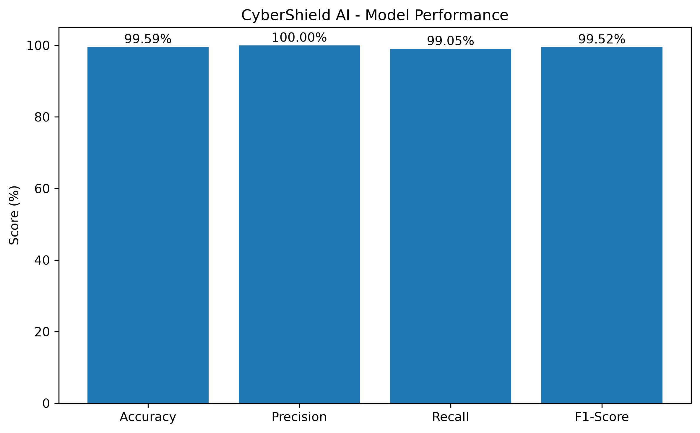
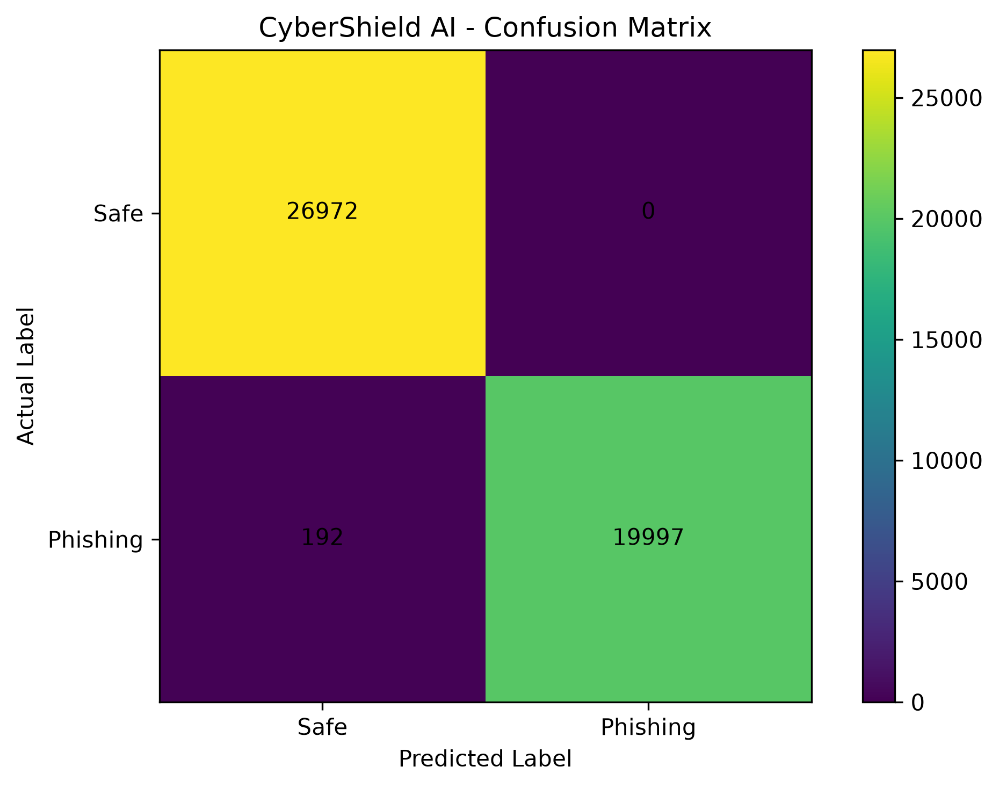

# 🛡️ CyberShield AI

### AI-Powered Phishing URL Detection Platform

CyberShield AI is a machine-learning-based web application designed to detect and analyze potentially malicious phishing URLs.

It combines **TF-IDF + Logistic Regression** with **rule-based security analysis** to provide a final threat assessment.

---

## 🚀 Features

* 🔍 Phishing URL Detection
* 🤖 Machine Learning Prediction
* 🧠 TF-IDF + Logistic Regression
* 🔐 HTTPS Security Analysis
* 🌐 Domain & URL Analysis
* ⚠️ Suspicious Keyword Detection
* 📊 Risk Score Calculation
* 📈 Model Performance Evaluation
* 🎯 Confusion Matrix Visualization
* 🖥️ Web-Based Security Dashboard

---

## 🧠 How It Works

```text
User enters URL
       ↓
URL Feature Extraction
       ↓
TF-IDF Vectorization
       ↓
Logistic Regression
       ↓
ML Prediction
       ↓
Rule-Based Security Analysis
       ↓
Risk Score Calculation
       ↓
Final Security Verdict
```

---

## 📊 Model Performance

CyberShield AI uses **TF-IDF Vectorization** with **Logistic Regression** for phishing URL classification.

| Metric    |   Score |
| --------- | ------: |
| Accuracy  |  99.59% |
| Precision | 100.00% |
| Recall    |  99.05% |
| F1 Score  |  99.52% |

### Model Performance



### Confusion Matrix



---

## 🛠️ Tech Stack

* **Python**
* **Flask**
* **Scikit-learn**
* **Pandas**
* **NumPy**
* **Matplotlib**
* **Joblib**
* **HTML & CSS**

### Machine Learning

* TF-IDF Vectorization
* Logistic Regression
* Rule-Based URL Analysis

---

## 📂 Project Structure

```text
CyberShield-AI/
│
├── app.py
├── scanner.py
├── train_model.py
├── evaluate_model.py
├── model_evaluation.py
├── model_visualization.py
├── feature_test.py
├── dataset_test.py
├── test_scanner.py
├── train_test_model.py
├── prepare_dataset.py
├── add_legitimate_urls.py
│
├── dataset/
│   ├── cybershield_dataset.csv
│   ├── phishing_dataset.csv
│   ├── train_dataset.csv
│   └── test_dataset.csv
│
├── model/
│   ├── logistic_phishing_model.pkl
│   ├── logistic_tfidf_vectorizer.pkl
│   └── model_metrics.json
│
├── static/
│   ├── style.css
│   └── screenshots/
│       ├── confusion_matrix.png
│       └── model_performance.png
│
├── templates/
│   └── index.html
│
├── requirements.txt
└── README.MD
```

---

## ⚙️ Installation

### 1. Clone the repository

```bash
git clone https://github.com/psmahajan360-lang/CyberShield-AI.git
```

### 2. Open the project directory

```bash
cd CyberShield-AI
```

### 3. Install dependencies

```bash
pip install -r requirements.txt
```

---

## ▶️ Run the Application

Start the Flask application:

```bash
python app.py
```

Then open the local URL shown by Flask in your browser.

---

## 🧪 Testing

The project includes testing and evaluation scripts for validating the phishing detection system.

Example:

```bash
python test_scanner.py
```

---

## 🔍 Example Workflow

```text
Enter URL
    ↓
Analyze URL
    ↓
Extract Features
    ↓
ML Prediction
    ↓
Security Rule Analysis
    ↓
Calculate Risk
    ↓
Display Final Result
```

The system provides a security assessment based on machine-learning prediction and URL security characteristics.

---

## 🎯 Project Objective

The objective of CyberShield AI is to provide a simple and intelligent system that helps users identify potentially malicious phishing URLs before interacting with them.

The project demonstrates the practical use of **Machine Learning, Natural Language Processing, Web Development, and Cybersecurity concepts** in a real-world application.

---

## ⚠️ Disclaimer

CyberShield AI is an educational and research project.

The system should not be considered a replacement for professional cybersecurity solutions, antivirus software, browser security systems, or enterprise security tools.

---

## 👨‍💻 Author

**Pranav Mahajan**

Computer Engineering Student

GitHub: https://github.com/psmahajan360-lang

LinkedIn: https://www.linkedin.com/in/pranav-mahajan-4390a331a

---

## ⭐ Support

If you find this project useful, consider giving the repository a ⭐ on GitHub.
